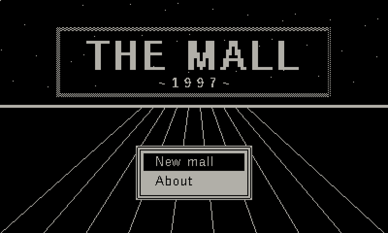
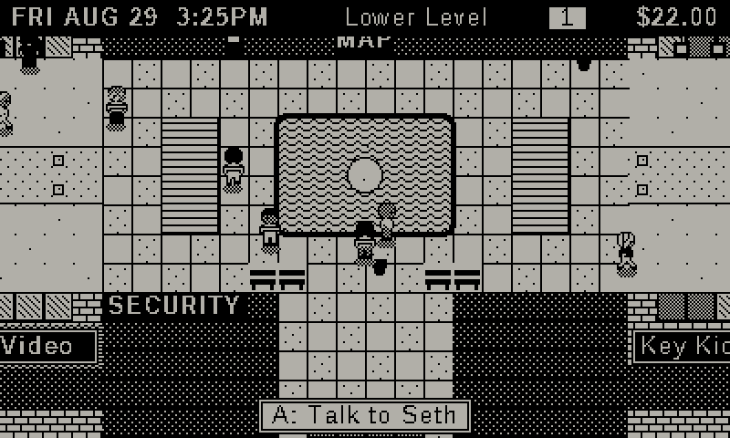
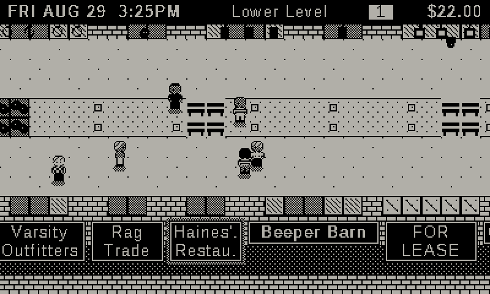
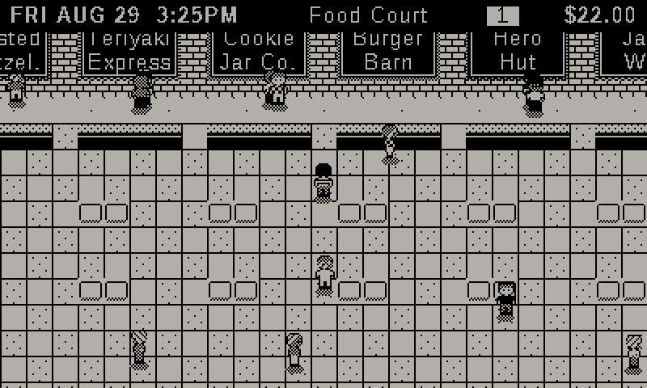
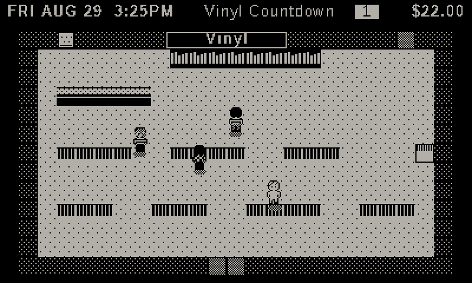
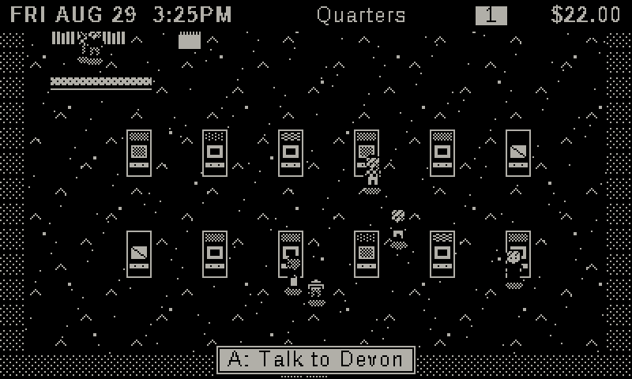
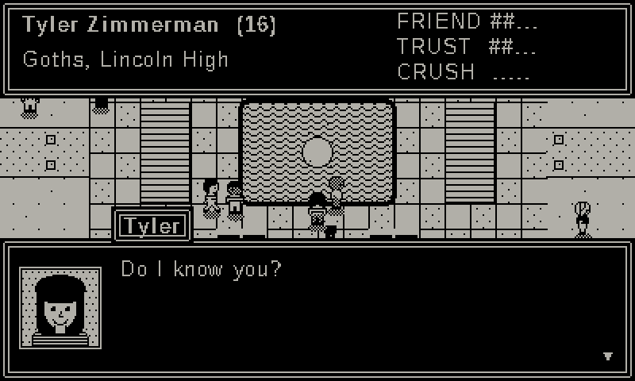
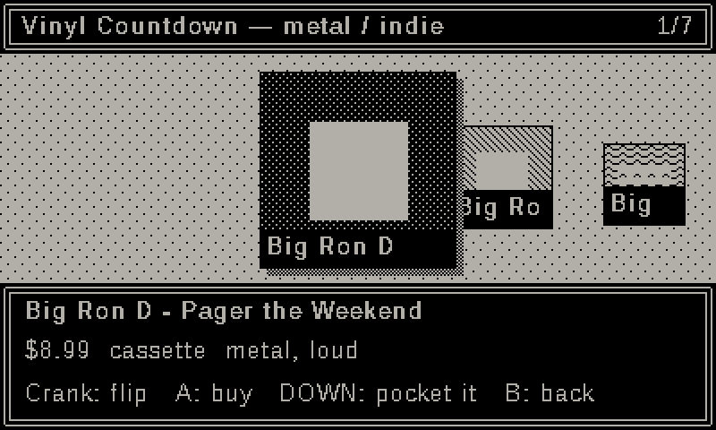
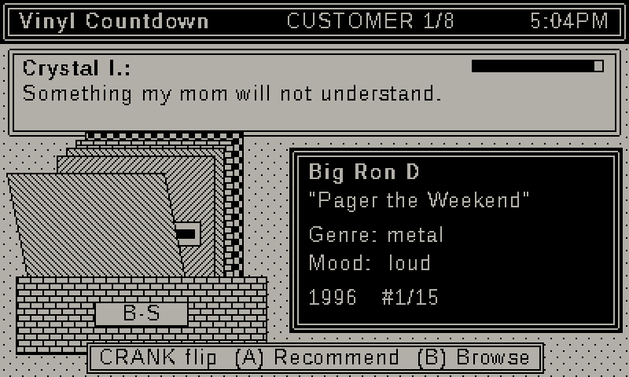
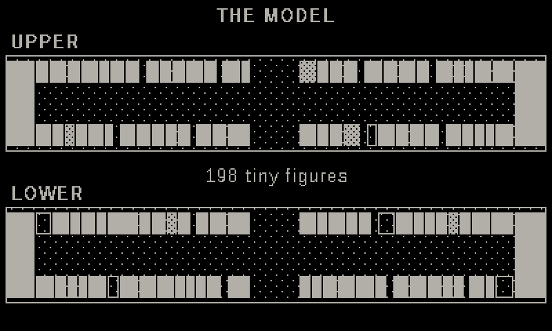

# THE MALL, 1997

A persistent life simulation for **Playdate**, written in Lua against Panic's
Playdate SDK. The whole game takes place inside one procedurally generated
American suburban shopping mall, starting Friday, August 29, 1997.

There is no goal. You are sixteen. You have $22, a pager, a backpack, three
friends and a curfew. The mall runs whether or not you're there: stores open,
struggle and close; people fall in and out of love; someone breaks your
arcade record while you're at school; a rumor about you reaches the food
court before you do.

> "I can live inside this place."

## Screenshots

These were rendered headlessly by `tools/screens.lua`, using the software
rasterizer in `tools/pdraster.lua` (an approximation of the Playdate system
font). They are shown at 2x.

| | |
|---|---|
|  |  |
|  |  |
|  |  |
|  |  |
|  |  |

## Building and running

1. Install the Playdate SDK and set `PLAYDATE_SDK_PATH`.
2. Compile the game and open it in the Simulator:

   ```sh
   pdc source MallOf1997.pdx
   open MallOf1997.pdx        # or: $PLAYDATE_SDK_PATH/bin/PlaydateSimulator MallOf1997.pdx
   ```
3. Sideload the `.pdx` to a device the usual way.

The game has no asset files. Every sprite, portrait, sign and tile is drawn
procedurally at runtime with the 1-bit graphics API, and text uses the system
font.

## Controls

| Input | Explore | Menus / scenes |
|---|---|---|
| D-pad | walk | move the selection |
| A | talk / use / enter | confirm |
| B | open the life menu (ME, BAG, PAGER, PEOPLE, RUMORS, NEWS, MALL, LORE, SAVE) | back |
| Crank | scroll pager messages on a ticker | flip record, VHS and clothing racks; scroll lists; spin the prize wheel; dial combination locks; enter arcade initials; strum at Teen Night; job minigames: pour soda, focus the projector, feed film, dial tokens, pick the CCTV feed |

## What's simulated

- **The mall** is generated from a seed. It has two concourse levels with
  roughly 100–140 storefronts, 2–5 anchor department stores, a food court with
  9–12 stalls, a six-screen cinema, an arcade, a center court with fountain,
  escalators and atrium, service corridors behind every store, a loading dock,
  management, security and maintenance offices, a parking lot and a roof.
  Under all of that are maintenance tunnels, a 1962 fallout shelter, a
  forgotten office and a locked room.
- **Stores** (20 categories, from clothing to a weird local store) each have a
  name, company, manager, staff, hours, popularity, an inventory level, sales
  history, rent, cash, security level, a back room, a customer demographic and
  relationships with their neighbors. The economics run every day. Weak stores
  go on sale, change managers and close. Vacancies get new tenants shaped by
  the trends of the moment.
- **About 500 NPCs** (clerks, managers, teens in cliques, parents, mall
  walkers, security, maintenance, mall management) each have a home, a job,
  a daily schedule, friends, enemies, crushes, partners, money, a mood, wants,
  secrets, a reputation, memories and possessions. They physically walk
  between areas along timed routes and stop to window-shop. You can follow
  someone from the arcade to the food court. Around them, an anonymous crowd
  sized from the day's footfall fills the concourses: busy on Saturday
  afternoons, nearly empty on a January weekday morning.
- **Relationships and rumors.** NPCs who share a space talk: friendships form
  and fade, crushes turn into dates and breakups, and cheating leaks. Rumors
  spread person to person, get exaggerated in the retelling, and change how
  people treat whoever they're about, including you.
- **Security and crime.** Guards patrol and cameras cover zones. Shoplifting
  is judged against who can actually see you, and evidence (witnesses, tape)
  matters. Consequences escalate from a warning, to detention with your parents
  called, to bans and being escorted out. People hear about it.
- **Jobs** at the record store, video store, food court, arcade, cinema,
  photo lab, bookstore, department store and, eventually, mall security. Each
  has its own minigame, and you can be promoted all the way to store manager.
- **Culture.** Fictional bands and albums with weekly charts. Fictional 1990s
  movies on weekly bookings. Four playable arcade cabinets with persistent
  high scores, monthly tournaments and rivals. Trends like the Plush Pal craze,
  the swing revival and Unsinkable mania. Teen Night gigs, including your own
  band's.
- **Time.** Minutes, school days, weekends, holidays (Halloween, Black Friday,
  Santa's throne, New Year's), seasons and renovations, with the outlet mall
  opening out by the interstate. 1997 becomes 1998.
- **World memory.** Closures, quits, breakups, bans, records and manager
  changes are permanent and go into a timeline. The NEWS tab shows it, and so
  does someone's handwritten ledger somewhere under the mall.

## Architecture

```
source/
  main.lua            imports (layered, top to bottom)
  core/               util (xorshift RNG, helpers), clock (calendar), save (datastore)
  gen/                names, content (music/movies/arcade), mallgen (slots/stores/cameras), npcgen
  world/              world (W, timeline, rumors, pager), areas (derived geometry, never saved)
  sim/                npcai, stores, economy, cinema, arcade, music, trends, social, romance,
                      security, jobs, player, events, management, lore, talk, worldsim (tick)
  minigames/          job minigames (record, video, food, arcade, cinema, photo, books,
                      department, security) + registry
  arcade/             cabinet games (serpent, orbital, tower, racer)
  ui/                 gfx (double-border boxes, neon dithers, text), input, sprites/portraits, mapview, crowd
  scenes/             scene stack, title, explore, dialog, shop, interact, menu, play, day, secret
```

- **Persistent entities have stable integer ids** (`W.stores[i]`,
  `W.npcs[i]`, `W.slots[i]`) and live only in the world table `W`, which is
  saved with `playdate.datastore`.
- **Area geometry is derived, not saved.** Tiles, doors, objects and spots are
  rebuilt from `W` and the seed whenever needed, so persistent entities are
  never regenerated when they come into view.
- **Generation is deterministic.** The same seed and the same inputs give the
  same history. There is a test for this, and no code path relies on
  string-key iteration order.
- **One `WorldSim.tick(dt)` runs everything**: live play (1 game minute per
  real second), time skips (shifts, movies), overnight, and the headless
  harness.

## Verifying without a Playdate

The SDK itself isn't needed to test the game. `tools/` contains a strict
headless mock of the Playdate runtime. It is built from the SDK's documented
function and constant list (`tools/pd_api_*.txt`), and **any call to an
undocumented API fails the run**.

| Command | What it does |
|---|---|
| `tools/build_lua32.sh <lua-5.4-src>` | Builds a Lua with 32-bit integers and floats like the Playdate runtime. Run the other tools with it: stock Lua's 64-bit integers hide overflow bugs. |
| `lua5.4 tools/apicheck.lua` | Static scan: every `playdate.*` / `gfx.*` reference must be documented. |
| `lua5.4 tools/test_games.lua` | Runs all 9 job minigames and 4 arcade games with random input. |
| `lua5.4 tools/flows.lua` | Scripted end-to-end play through the real UI: new game, shopping, shoplifting and getting caught, every dialog option, interview and shift, arcade and initials, prize wheel, movie, menus, the secret locked room, band gig, save/load, day cycles, doors and escalators. |
| `lua5.4 tools/smoke.lua [frames]` | Random-input fuzzing of the whole game. |
| `lua5.4 tools/sim30.lua [seed] [days] [--bot]` | Simulates a month and prints a report on every system. |
| `lua5.4 tools/screens.lua` | Renders screenshots with a software rasterizer into `docs/screens/`. |

See [`docs/INSPECTION.md`](docs/INSPECTION.md) for what the 30-day
simulation revealed, what was fixed, and which systems were deepened.
