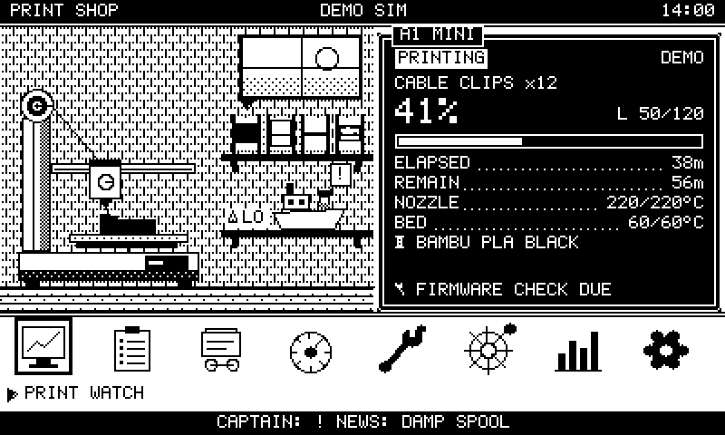
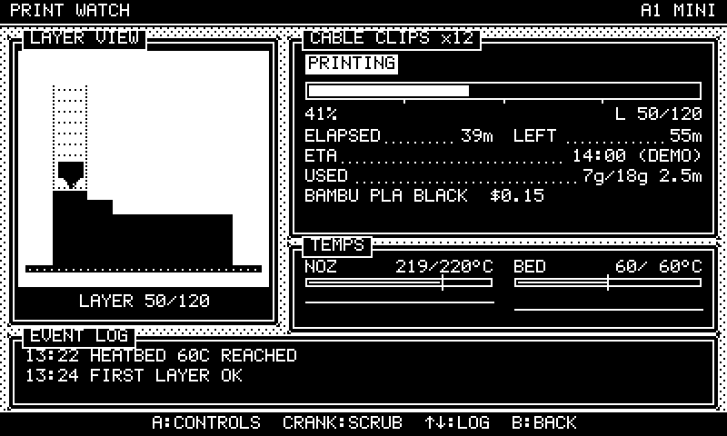
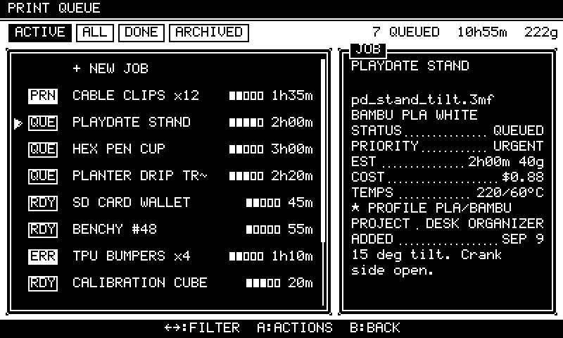
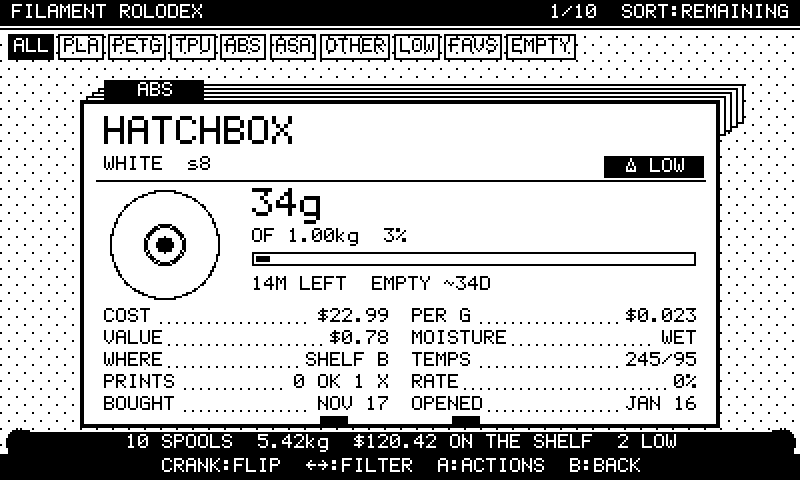
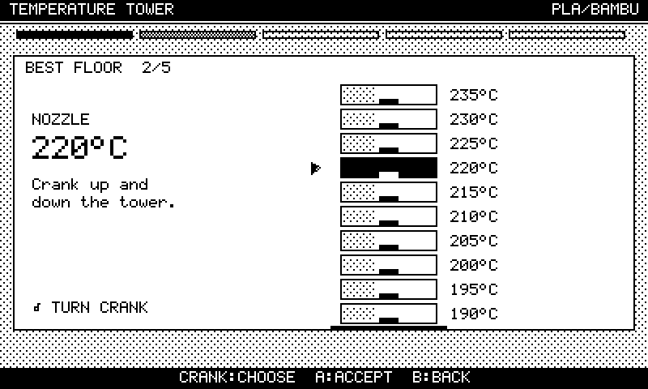
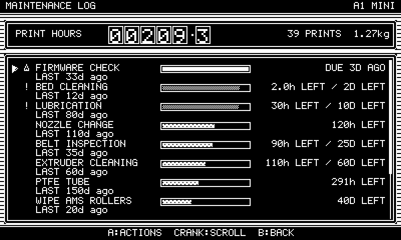
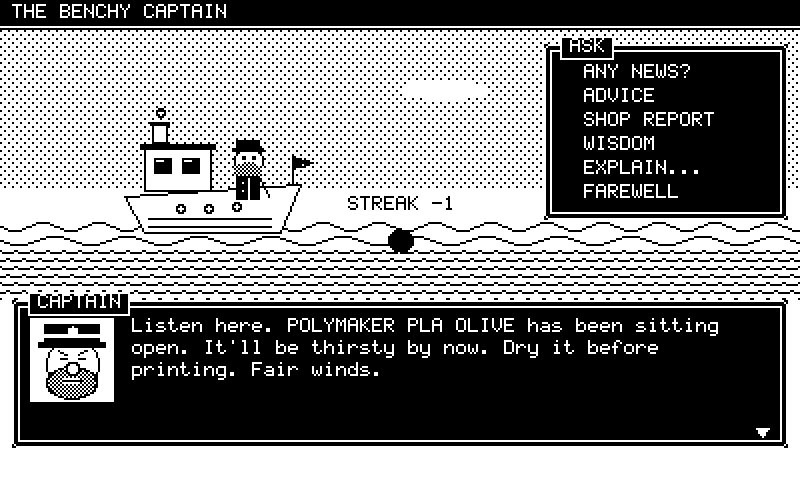
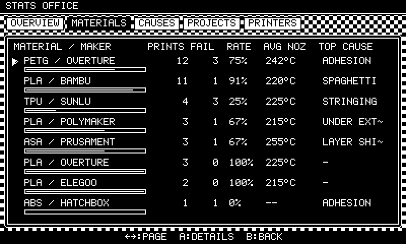

# PRINT SHOP

A tiny 16-bit-console workshop for your 3D printer, running on the Panic
Playdate in 1-bit. It combines six tools that share one logbook:

| | Tool | What it does |
|---|---|---|
|  | **Workshop** (home) | Your A1 Mini on the bench, animated by its real state (idle, heating, printing, paused, error, complete). Live job, %, layers, times, temps and filament. Crank walks between stations, or scrubs the layer preview while printing. |
|  | **Print Watch** | Current print in detail: the part growing layer by layer, progress, ETA, temps with history, filament used and its cost, and the event log. Pause, resume, cancel, clear the plate, swap a spool after a runout. |
|  | **Print Queue** | Jobs from IDEA to COMPLETE. Add, edit, duplicate, archive, retry, mark done or failed. Pick MOVE and turn the crank to ratchet a job up or down the line. |
|  | **Filament Rolodex** | One card per spool. Crank flips cards. Filters, sorting, low-spool flags, moisture ageing, weigh-ins, cost per gram, burn-rate forecast, a usage ledger with a weekly chart. |
|  | **Calibration Wizard** | Guided procedures (bed level, flow, temp tower, retraction, dimensions, first layer, tolerance). The crank dials in what you measured. Results become profiles per printer, material and maker. |
|  | **Maintenance Log** | Chores due by print hours or days, whichever comes first, on an hour odometer that every print advances. Custom tasks, one-off events and full history. |
|  | **The Benchy Captain** | A sea captain whose boat is a Benchy. He is a rule-based advisor built from phrase banks: he celebrates, commiserates, nags about chores and suggests calibrations based on your logged failures. |
|  | **Stats Office** | Success rates per material and maker, failure causes, projects (with a per-project logbook) and printers. |

## The point: everything is connected

Finishing a print (from a live printer, the demo sim, or **MARK COMPLETE**
for offline prints) runs one transaction in `services/printing.lua`:

* grams come off the spool, and a row is written to its consumption ledger
* the spool's success or failure count goes up
* a history record is written, with the failure cause if there was one
* printer stats update: prints, hours, grams, streak
* the maintenance hour odometer advances, and chores that tip into
  *due soon* or *due* appear on the workshop banner
* the job gets its status, dates and attempt count
* the Captain gets news in his inbox, a toast shows, project totals update
* the save is written immediately

A failed print also consumes filament (partial grams, adjustable with the
crank) and feeds the failure statistics. From those statistics the Captain
suggests the right calibration or chore. For example, *"PETG / OVERTURE: 12
prints, 3 failures. Most trouble: adhesion. Best nozzle: 242°C."*

Saving a calibration as *recommended* re-profiles matching queued jobs and
updates the spools' favourite temperatures. New jobs copy the most specific
recommended profile: exact maker, then material-wide, then defaults.

The demo printer also reacts to your shop. A WET spool strings, an overdue
bed clean loses adhesion, overdue belts shift layers, ABS on an open-frame
A1 Mini warps, and a spool lighter than the job **runs out mid-print**. The
queue warns you about that beforehand.

## Building and running

You need the [Playdate SDK](https://play.date/dev/) 2.7 or later. The bridge
provider uses `playdate.network`; everything else works on earlier SDKs.

```sh
cd printshop
pdc source PrintShop.pdx          # compile
open PrintShop.pdx                # macOS: opens in the Simulator
# or: $PLAYDATE_SDK_PATH/bin/PlaydateSimulator PrintShop.pdx
```

Sideload `PrintShop.pdx` to a device from the Simulator (*Device > Upload
Game*) or through play.date.

> **Honesty note:** this code was written and tested in an environment
> without the Playdate SDK. It has **not been compiled with `pdc` or run on
> hardware yet**. Every SDK call is checked against the documented API (see
> Testing below), and all logic and UI code runs in a strict headless mock.
> Expect small fixes on the first real build, most likely around fonts,
> timing or the keyboard.

### Controls

| Where | Crank | D-pad | A | B |
|---|---|---|---|---|
| Workshop | idle: change station, printing: scrub layers | ←→ station, ↑ Watch, ↓ Queue | open station | Captain's advice |
| Lists | scroll | move, ←→ tab or filter | actions menu | back |
| Queue MOVE | ratchet the job one slot per detent | ↑↓ move | drop | drop |
| Rolodex | flip cards | ↑↓ flip, ←→ filter | card actions | back |
| Dials | adjust (detents with clicks) | ←→ ±1 step, ↑↓ ±10 | accept | cancel |
| Dialogs | crank forward speeds up the typing | | next page | skip |

System menu: **workshop** (back home), **captain**, **demo spd**.

## Printers and providers

All printer access goes through the `PrinterProvider` interface
(`source/providers/provider.lua`):

```
getStatus()  getTemperatures()  getProgress()  getCurrentJob()
getAMSOrSpoolState()  pause()  resume()  cancel()  startJob(spec)
update(dt)  pollEvents()  serialize()  restore(state, awaySec)
```

| Provider | Status |
|---|---|
| `DemoProvider` | Complete simulated printer: heating curves, layers, AMS lite slots (from Rolodex locations), runouts and failures driven by shop data. It keeps printing while the app is closed. |
| `LocalBridgeProvider` | Real HTTP client for the companion bridge ([docs/BRIDGE.md](docs/BRIDGE.md)). Derives complete and failed events from state changes. Adopts jobs started on the printer into the queue. |
| `BambuProvider` | Maps Bambu's raw MQTT `print` report (relayed by the bridge) onto the interface, and sends pause, resume and stop. **Direct MQTT from the Playdate is not implemented**: the SDK has no MQTT client and can't trust the printer's self-signed certificate. `startJob` returns *"START ON PRINTER; SHOP WILL FOLLOW"*. |

The bridge is `bridge/printshop_bridge.py`: Python standard library, plus
`paho-mqtt` for `--bambu HOST SERIAL ACCESS_CODE`. It also has a `--demo`
mode.

## Code layout

```
source/
  main.lua            app bootstrap, system menu, lifecycle saves, event wiring
  lib/                util, clock, deterministic rng, event bus (pure Lua)
  data/               5x9 pixel font, seed shop, calibration procedures, Captain phrase banks
  models/             enums, record normalizers, schema versions + migrations
  services/           store (persistence), filament, queue, stats, maintenance,
                      calibration, printing (orchestrator), captain (dialogue rules)
  providers/          provider interface, demo, bridge, bambu
  components/         draw (house style), text, input, sfx, widgets, form, list, sprites
  screens/            home, watch, failure, queue, job_edit, rolodex, spool_edit,
                      calibration, calib_run, maint, captain, stats, settings
  launcher/           card + icon (rendered by tools/make_launcher.lua)
bridge/               companion HTTP bridge + tests
tests/                strict Playdate mock, rasterizer, test suite, screenshot script
tools/                API checker, launcher and screenshot helpers
docs/                 ARCHITECTURE.md, BRIDGE.md, screenshots
```

Details, including the data model, schema migrations, the Captain's rule
engine and performance notes, are in [docs/ARCHITECTURE.md](docs/ARCHITECTURE.md).

## Testing

No Playdate SDK in CI? Then:

```sh
cd printshop
./tools/check.sh                       # luac syntax + API check + Lua test suite
python3 -m unittest discover bridge    # bridge tests
lua5.4 tests/shots.lua && python3 tools/pbm2png.py   # screenshots into tests/out/
```

* `tests/pd_api.lua` is generated (`tools/gen_api_list.py`) from
  `tools/playdate_api_stub.lua`. That stub is the LuaCATS annotation file
  from [playdate-luacats](https://github.com/notpeter/playdate-luacats),
  which is generated from Panic's *Inside Playdate* documentation.
* `tests/mock_playdate.lua` builds the whole `playdate.*` namespace from
  that list. **Touching an undocumented function, method or constant raises
  an error.**
* `tools/check_api.py` statically checks every `playdate.*` reference, and
  method calls on SDK objects, in the source.
* `tests/run.lua` has 51 tests: persistence round trips, corrupt, partial
  and newer saves, v1 → v4 migration, the finish-print ripple, runout and
  spool swap, deterministic demo failures, pending-failure logging through
  the UI, calibration re-profiling, maintenance crossings, Bambu mapping, a
  **bridge end-to-end test against the real Python bridge**, Captain variety
  and determinism, every screen and its empty state, crank reordering,
  keyboard entry, the system menu, a 4000-step input fuzz, and regression
  tests for every issue found in code review.
* `tests/raster.lua` is a small 1-bit rasterizer. It renders the
  screenshots in `docs/screenshots/`, so layout gets reviewed visually too.

## Data

One JSON document in the Playdate datastore (`printshop.json`), schema v4:
printers, spools, jobs (array order = queue order), history (with failure
causes), a consumption ledger, calibration profiles and runs, maintenance
tasks and log, the Captain's inbox, the printer event log and provider
state.

* **Autosave** at most every 4s while dirty, plus immediate saves after each
  print transaction and on terminate, sleep, lock and pause.
* **Migrations** from v1, v2 and v3 are real and tested. The original file
  is backed up as `printshop-v<N>` first.
* **Repair on load:** every record is normalized, duplicate ids are
  reassigned, dangling spool and printer references are cleared, and the
  "one active job per printer" rule is enforced.
* **Corrupt or newer saves** are backed up and never silently overwritten.
* Settings > **RESET TO DEMO SHOP** or **RESET TO EMPTY SHOP** starts over.
