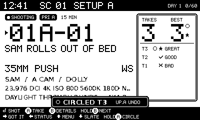
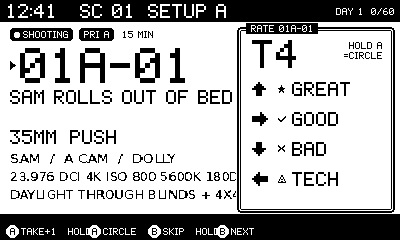
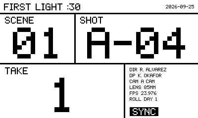
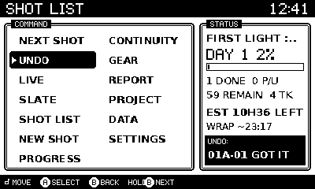
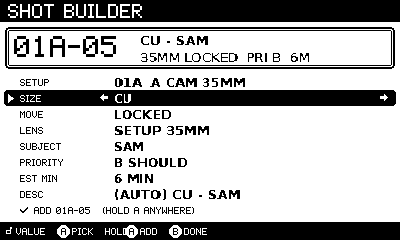
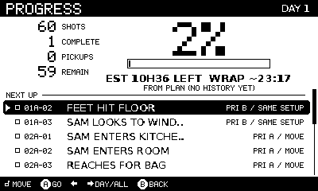
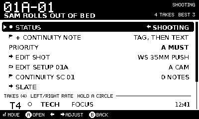
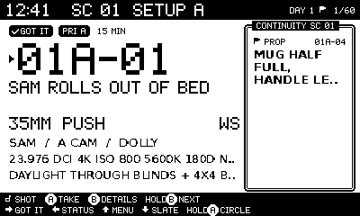
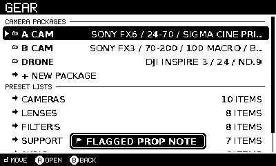
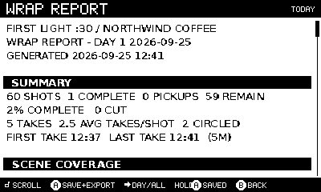

# SHOT LIST — a Playdate utility for real shoots

SHOT LIST is a one-handed shot list, take logger, slate and wrap-report tool
for the Playdate (400×240, 1-bit, 30 fps, Lua SDK). It is meant to live in a
1st AD's, script supervisor's or DP's pocket on a professional set and answer
"what's next?" faster than a phone.



```
PROJECT > SHOOT DAY > SCENE > SETUP > SHOT > TAKE
```

## Build and run

```sh
pdc shotlist/source ShotList.pdx     # Playdate SDK compiler
open ShotList.pdx                    # Simulator; or sideload to device
```

No assets or fonts are shipped. Large type uses a built-in 5×7 pixel font
(`ui/pixfont.lua`) scaled 2–10×, and small type uses the system font, so the
source folder compiles as it is.

### In a browser

`python3 tools/build_web.py OUT_DIR` writes a playable page (`index.html` +
`glue.wasm`). It runs the unchanged `source/` Lua in a Lua 5.4 VM
([wasmoon](https://github.com/ceifa/wasmoon), MIT, fetched from npm) on a
browser stand-in for the Playdate runtime (`web/pdweb.lua`). Data is kept in
the browser's storage the way the Data folder is kept on device. Serve the
folder over HTTP (`python3 -m http.server -d OUT_DIR`); it is not the Panic
Simulator, so check fonts and timing there before a shoot.

## LIVE SHOOT: the home screen

| Input | Action |
|---|---|
| **A** | **TAKE +1**, then rate with the d-pad: **↑ GREAT · → GOOD · ↓ BAD · ← TECH** (TECH asks for the issue) |
| A again (on the rating card) | the next take (the current one stays unrated) |
| **hold A** | circle the last take |
| **B** | details: status, priority, + continuity note, edit shot/setup, take log |
| **hold B** | **NEXT**: jump to the next priority shot, **from any screen** |
| **→** | **GOT IT**, then jump to NEXT automatically |
| ← | status picker (NOT SHOT, UP NEXT, SHOOTING, GOT IT, PICKUP, CUT) |
| ↑ / ↓ | menu (hub) / slate |
| **crank** | scrub shots. Spin faster to step by **setup**, faster still by **scene** (the side panel shows `BY SHOT/SETUP/SCENE`). |

A typical shot costs about 2 presses per take (A, rating) plus → to move on.
In the simulated 60-shot day the average was 10.5 interactions per shot,
takes included.

### "We're losing the light. What's next?"

- **Hold B** (1 interaction, from any screen) goes to LIVE on the top-ranked
  open shot. A banner says why it was chosen, e.g. `NEXT 1/19: PRI A / SAME SETUP`.
  Hold B again within 8 s to take the next alternative.
- **System menu → NEXT SHOT** (2 interactions) does the same from the
  Playdate menu.
- **System menu → GO: RUSH** switches NEXT to strict priority and jumps.

The NEXT ranking, in order:
1. shots the AD marked **UP NEXT**
2. shots scheduled for today
3. priority A > B > C, where in **BALANCED** mode (the default) shots in the
   setup you are already lit for rank three tiers higher. This finishes the
   setup before relighting, because a C shot left behind costs a whole relight
   later. **RUSH** mode uses strict priority.
4. locality: same setup > same scene > move
5. unshot before pickups
6. schedule order after the current shot

### System menu

Playdate OS allows at most **three** custom menu items. The five requested
actions map to them like this:

| Item | Does |
|---|---|
| NEXT SHOT | NEXT |
| ADD TAKE | TAKE +1 on the current shot |
| GO: `SLATE` / `PICKUP` / `WRAP` / `RUSH` | slate, mark PICKUP, wrap report, strict-priority NEXT |

While the menu is open, its left half shows a status card with the current
shot, the next shot and % complete.

## Screens

| | |
|---|---|
|  **Rate**: the d-pad direction is the rating. |  **Slate**: SCENE / SHOT / TAKE at up to 10× scale. A logs a take, the crank moves the shot, ↑ inverts, ↓ toggles MOS/SYNC. Toasts never draw over the slate. |
|  **Hub**: every tool, plus live status and UNDO (pre-selected right after an undoable action, so UP, A undoes). |  **Shot builder**: controlled vocabularies on the crank; hold A saves and starts the next shot with the number +1 and the fields carried over. No typing needed. |
|  **Progress**: SHOTS / COMPLETE / PICKUPS / REMAIN, %, remaining time and wrap estimate, NEXT UP queue, per-scene coverage. |  **Details**: status and priority dials, quick continuity note, and a take log where ←/→ re-rates and hold A circles. |
|  **Continuity**: flagged notes appear automatically when LIVE enters that scene. |  **Gear**: named camera packages (A CAM = FX6 / 24-70 / VND) and preset lists that feed every picker. |



**Wrap report**: completed and missing shots, pickups, circled takes,
technical problems, performance notes, open continuity flags, scene coverage,
camera and lens usage (by takes), total takes, and average takes per shot.
**A** stores it in the project and writes `.txt`, `.json` and `.csv` files to
`Data/.../export/`.

**Templates**: Commercial, Interview, Documentary, Narrative, Social, Product
and B-roll. Each seeds the project notes, cast, days, scenes, setups with
technical defaults (fps, resolution, WB, ISO, shutter, ND, support, audio),
and starter coverage. "LOAD 60-SHOT DEMO" seeds the *FIRST LIGHT :30* coffee
commercial used by the simulation.

The keyboard is used only for free text: descriptions, note text, names, and
the "TYPE CUSTOM…" escape at the end of every vocabulary picker. Every other
field is a crank or d-pad selector, and free-text fields also cycle through
values already used in the project with ←/→.

## Data safety

See [docs/SCHEMA.md](docs/SCHEMA.md) for file formats.

- **Every production action is an op**, written to `journal.jsonl`
  (append + close) before the call returns. A crash loses at most the op
  being written; a torn last line is skipped on load.
- **Snapshots** are written when you have been idle for 1.5 s (or after 40 ops
  or 45 s). The write goes to `shotlist_new.json`, the previous snapshot is
  kept as `shotlist_prev.json`, and the new one is then promoted by rename.
  The journal is truncated only after the new snapshot has been promoted.
- **On load** the newest readable snapshot is used and the journal is replayed
  on top of it. If no snapshot is readable, the files are moved to `rescue-*/`
  rather than being overwritten.
- **Rolling backups** go to `backups/snap1..8.json`: every 15 minutes of
  activity, at wrap, and before a restore, import, new project or delete.
  Restore them from DATA.
- **Undo** covers the last 40 ops. It is deliberately **not** bound to B:
  B means "back" everywhere, and in testing a reflexive back-press reverted a
  GOT IT.
- **Schema versioning**: `db.schema` plus `Schema.MIGRATIONS[v]`. A newer
  database is refused rather than truncated. Unknown fields are kept.
- Saves also happen on `gameWillTerminate`, `deviceWillSleep`,
  `deviceWillLock` and `gameWillPause`. Auto-lock is disabled while the app
  runs.

## SDK API verification

The Panic SDK download and docs host were not reachable from the build
environment. Every Playdate API used here was checked against
[playdate-luacats](https://github.com/notpeter/playdate-luacats), type stubs
generated from *Inside Playdate* that include its text. Behaviour that
shaped the design:

- the three-custom-menu-item limit
- `AButtonHeld` fires only after a fixed 1 s, so long-press is implemented
  from `getButtonState()` with a configurable threshold
- `getCrankChange()` returns `change, acceleratedChange`
- `graphics.drawText` treats `*` and `_` as style markup, so all UI text goes
  through `font:drawText`, which does not
- `file.rename`, `json.encodeToFile` / `decodeFile` and `setMenuImage` (only
  the left 200 px is visible)

Build with `pdc` and do a quick pass in the Simulator before a shoot. The
headless harness cannot catch font-metric differences.

## Tests and the headless harness

```sh
cd shotlist && ./run_tests.sh               # needs lua5.4
FRAMES=/tmp/sl ./run_tests.sh               # + PNG screenshots (python3 + Pillow)
```

- `tests/pdstub.lua` is a fake `playdate` runtime. It records graphics calls,
  keeps files in a temp Data folder, drives buttons, crank, keyboard and
  system menu, and enforces the three-item menu limit. It can also simulate
  power loss mid-write.
- `test_core.lua` covers the model, NEXT ranking, stepping, journal replay,
  torn journal and snapshot writes, corrupt-snapshot fallback, the backup
  ring and restore, migrations, the report, and import/export.
- `test_workflows.lua` covers the system menu, undo, the builder, the
  browser, gear presets, settings, import and project switching.
- `test_web.lua` boots the app on the browser runtime, logs a take, uses the
  system menu, keyboard and crank, and checks that a reload restores it.
- `sim_commercial.lua` plays the full 60-shot day through button presses
  only, and fails if NEXT ever takes more than 2 interactions. See
  [docs/FRICTION_AUDIT.md](docs/FRICTION_AUDIT.md).
- `tools/render_frames.py` rasterises the recorded frames. Glyph shapes are a
  stand-in font stretched to Asheville-like metrics; positions and widths
  are faithful.

## Layout

```
source/main.lua          boot, callbacks
source/core/             no UI: util, vocab, schema, model (ops, NEXT, estimate),
                         store (journal/snapshots/backups/undo), templates, report, interchange
source/ui/               pixfont, gfx (windows, icons, hints), input (taps/holds/repeat/crank), app (stack, NEXT, menu)
source/screens/          live, overlays, details, slate, hub, browser, builder,
                         progress, continuity, gear, report, project (+data, settings, welcome)
tests/ tools/ docs/
```
